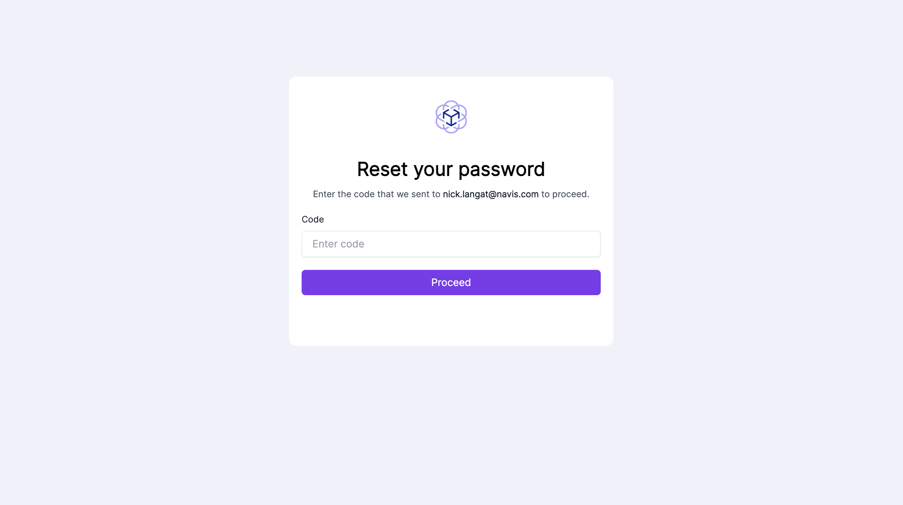
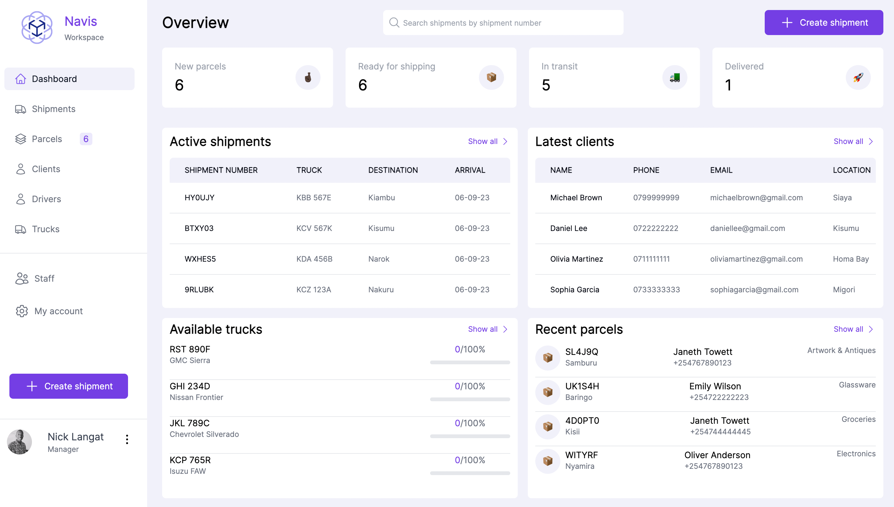
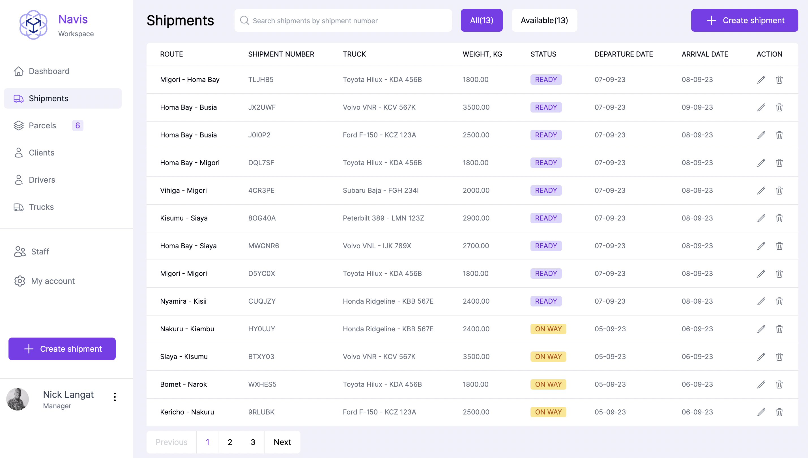
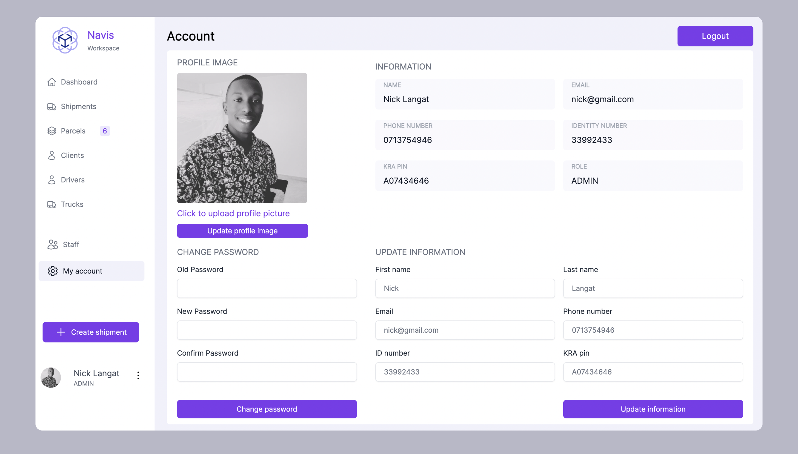

# Project Description: Navis

Navis is a company that provides logistics, shipping, warehousing and fulfilment services. This platform aims to give staff, managers and admins a positive and high experience when using the dashboard. 

# HOW IT WORKS:

Let’s assume we have a customer named Alice. Alice lives in Nairobi county. She has bought a 65 inch Samsung television and a Sony home theatre system. She would like to send these electrical appliances to her parents back at home in Kericho county. That is where Navis comes in. Alice visits Navis' Nairobi office where a Navis staff member welcomes her and registers Alice as a client in the system. Her electrical appliances are recorded in the parcels module as a parcel. The system sends a payment request to her mobile phone and she accepts the request by entering her MOMO PIN. Her parcel is then added to a shipment record that does the Nairobi-Kericho route. Alice leaves Navis’s office. Every time her parcel status changes she receives an email and SMS notification and when the parcel arrives to Kericho, her parents will receive a text message and a phone call to pick up the parcel. At this point the circle is complete. This process is true to all other clients and routes supported by the system.

 

# PLATFORM MODULES:

The Navis platform includes several modules listed below:

Shipments module

Parcels module

Drivers module

Trucks module

Clients module

Staff module

Admin dashboard module

Authentication module

Notifications module

Account settings module

Each module has an equivalent backend API and it is described below in detail including how it looks like in the browser:

Authentication module
The auth module allows the staff of the company to register and log in to the platform so that they can access and operate on the several modules the platform offers. On the backend the User table is role based and therefore logged in staff members are only able to execute tasks that are assigned to their roles. For examples only managers can delete entries while regular staff members can only create, view and update certain modules. The pages look like below:

# Login page:

 

  

# Password reset pages:

  

  

The managers are responsible for registering and verifying the staff. Managers are added to the system by super admins who have 360 access to the system. Upon a successful login request, the user is taken to the dashboard page.

 

# Dashboard page:
The dashboard page provides essential information in a summarised manner and designed to assist staff in managing the various aspects of each module and allows for a quick glancing of what is happening where. It presents an overview of key data numerically, latest available and important trends on various modules and also introduces a side navigation bar to facilitate easy navigation throughout the dashboard.  It looks like below:

  

 

# Shipments page:
The shipments page shows a table that lists all shipments that are ongoing, complete or delayed. At the top it allows for searching of a particular shipment using its shipment number and also provisions a button to create a new shipment. It has two other buttons that allows for changing the view from a table view to card view. A staff member can create a new shipment, view and edit its details and the manager can delete the shipment. It looks like so:

  

  

  

# Shipment page:
This page facilitates the the control of parcels/goods that are scheduled for shipment and allows parking of parcels to ensure they reach their intended destinations. Here , staff can add or remove parcels to the truck view the parcel list and finish loading the truck in readiness for shipping. The page looks like below:

  

 

# Parcels page:
This page lists all parcels in the system and allows for new parcels/goods to be registered into the system. Staff can create and edit parcels while managers can delete parcels. There is also a search bar that allows for searching using a parcel number. It looks like:

  

  

  

# Clients page:
This page lists all clients in the system and allows for new clients to be registered into the system. Staff can create and edit clients while managers can delete clients. There is also a search bar that allows for searching using a client’s name or identity number. It looks like:

  

  

  

# Drivers page: 
This page lists all drivers in the system and allows for new drivers to be registered into the system. Staff can create and edit drivers while managers can delete drivers. There is also a search bar that allows for searching using a driver’s identity  number. It looks like:

  

  

  

# Trucks page:
This page lists all trucks in the system and allows for new trucks to be registered into the system. Staff can create and edit trucks while managers can delete trucks. There is also a search bar that allows for searching using a registration number. It looks like:

  

  

  

 

# Staff page:
This page lists all staff in the system and allows for new staff to be registered into the system. Staff need to be verified by managers who can also delete staff. There is also a search bar that allows for searching using a staff’s identity number. It looks like:

 

  

  

  

# Accounts page:
The accounts page allows staff to view and update any personal information. It also allows one to change password among other things. It looks like:

  

# Notifications:
Notifications are crucial in letting the users know what is the result of their actions. Notifications are platform wide and dispatched every time a new client, truck, driver, parcel, shipment is created, edited or deleted. Below is the notifications module in action:

 

# Mobile responsiveness
The platform is mobile friendly and responsive and here are some of the screens viewed from a mobile device:

 

 
